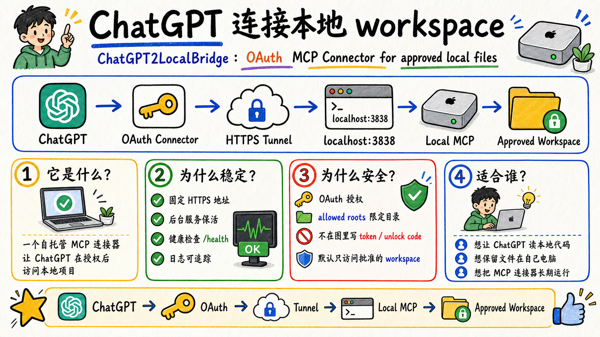
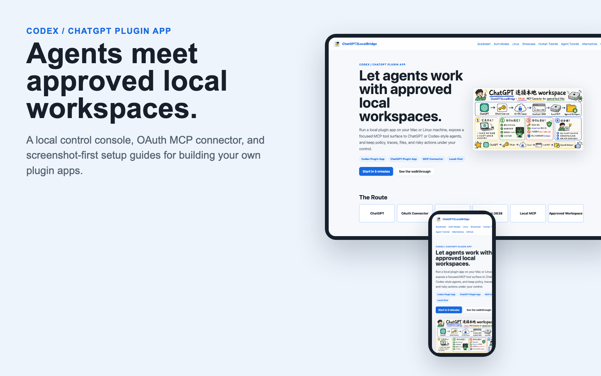
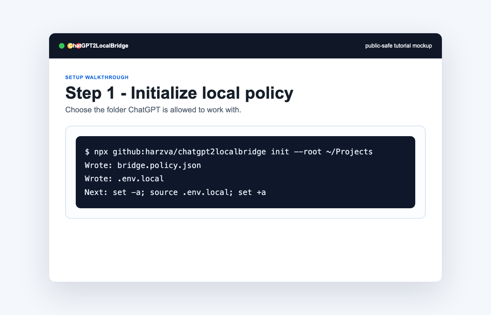
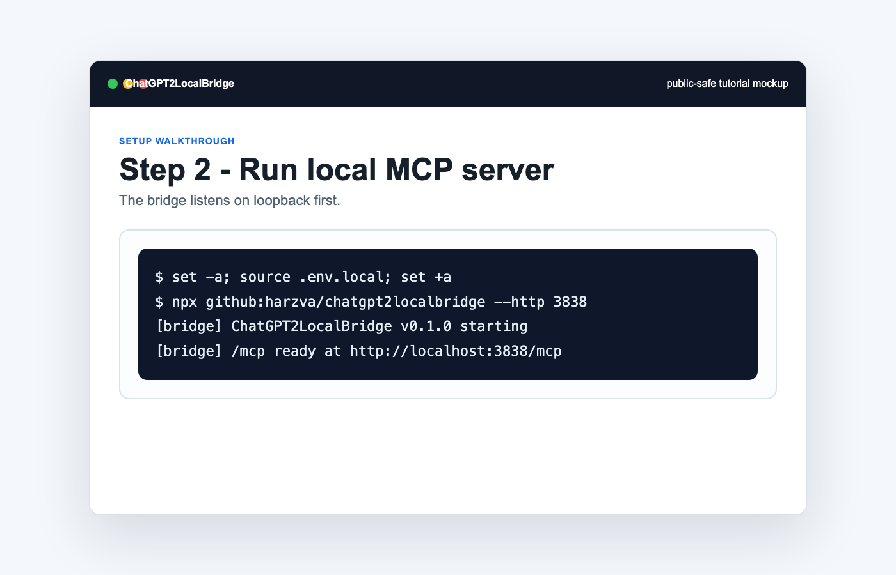
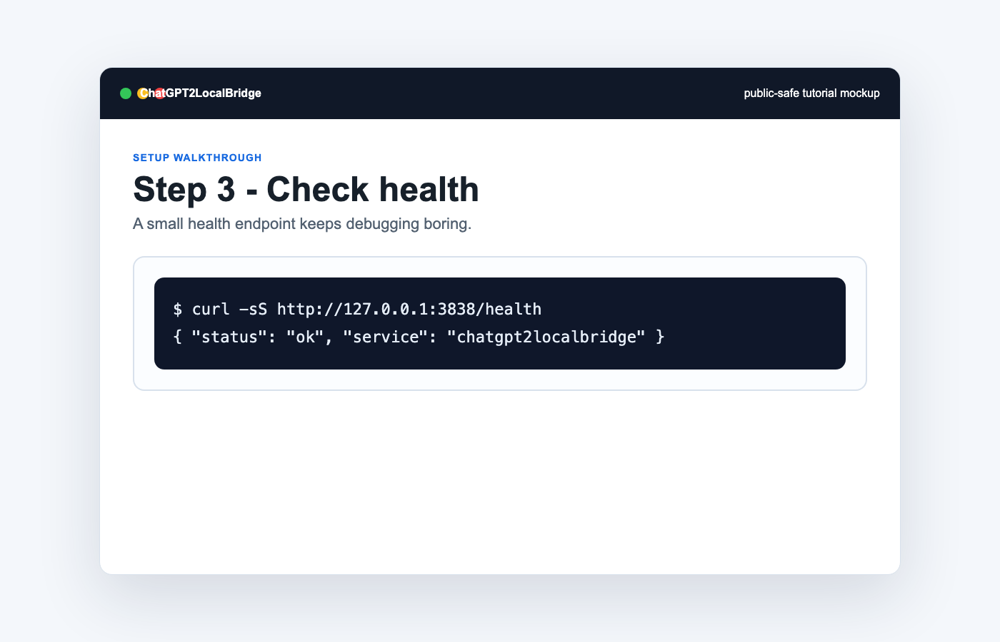
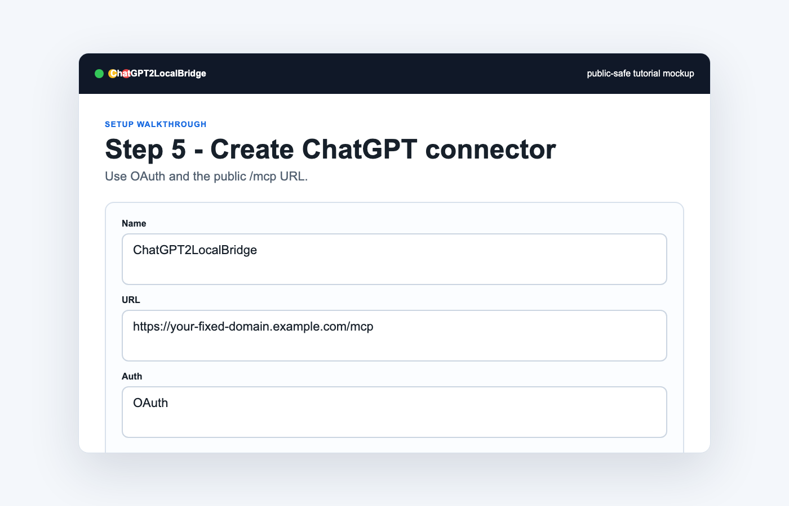
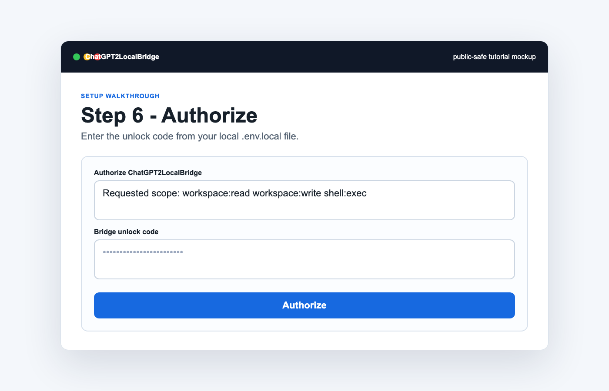
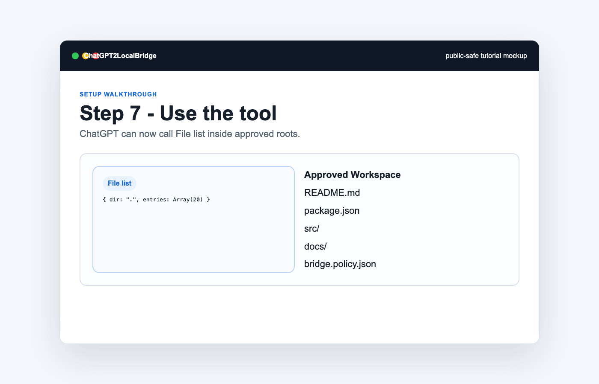

<div align="center">
  
  <h1>ChatGPT2LocalBridge</h1>
  <p><strong>OAuth MCP Connector for approved local files.</strong></p>
  <p>
    
    
    
    
  </p>
  <p>
    <a href="./docs/index.html">Pages source</a>
    ·
    <a href="./docs/showcase.html">Showcase</a>
    ·
    <a href="./docs/human-tutorial.html">Human tutorial</a>
    ·
    <a href="./docs/agent-computer-use.html">Agent tutorial</a>
    ·
    <a href="./docs/alternatives.md">Alternatives</a>
    ·
    <a href="./docs/sync-flows.md">Sync flows</a>
  </p>
</div>



<!-- showcase:start -->
<p align="center">
  
</p>
<!-- showcase:end -->

ChatGPT2LocalBridge is a self-hosted MCP server that lets ChatGPT access approved local workspaces after OAuth authorization. It is designed for people who want ChatGPT to inspect or operate on local project files without uploading the whole workspace elsewhere.

It is not a legacy ChatGPT plugin. It is best described as:

- **MCP Server**
- **ChatGPT Custom Connector**
- **OAuth Local Workspace Bridge**

> Unofficial project. Not affiliated with OpenAI.

## Route

```text
ChatGPT
  -> OAuth MCP Connector
  -> HTTPS tunnel
  -> http://127.0.0.1:3838/mcp
  -> ChatGPT2LocalBridge
  -> approved local workspace roots
```

ChatGPT does not directly mount your disk. It calls MCP tools, and every file operation is checked against `bridge.policy.json`.

## 30-Second Install

```bash
npx github:harzva/chatgpt2localbridge init --root ~/Projects
set -a; source .env.local; set +a
npx github:harzva/chatgpt2localbridge --http 3838
```

Local clone flow:

```bash
git clone https://github.com/harzva/chatgpt2localbridge.git
cd chatgpt2localbridge
npm install
npm run build
node dist/index.js init --root ~/Projects
set -a; source .env.local; set +a
node dist/index.js --http 3838
```

Health check:

```bash
curl -sS http://127.0.0.1:3838/health
```

Local operator console:

```text
http://127.0.0.1:3838/app
```

## ChatGPT Connector Setup

Expose the local server through HTTPS:

```bash
ngrok http 3838 --url=your-fixed-domain.ngrok-free.dev
```

Then create a ChatGPT Custom Connector:

| Field | Value |
| --- | --- |
| Name | `ChatGPT2LocalBridge` |
| URL | `https://your-fixed-domain.ngrok-free.dev/mcp` |
| Auth | OAuth |

When the authorization page opens, enter the unlock code from `.env.local`. Do not paste unlock codes or tokens into public chats, issues, screenshots, or commits.

## Screenshot Walkthrough

| Step | Preview |
| --- | --- |
| Initialize local policy |  |
| Run local MCP server |  |
| Check `/health` |  |
| Create connector |  |
| Authorize |  |
| Test file listing |  |

Full guides:

- [Human setup tutorial](./docs/human-tutorial.html)
- [Agent + Computer Use tutorial](./docs/agent-computer-use.html)
- [Visual showcase gallery](./docs/showcase.html)
- [Markdown human tutorial](./docs/tutorial-human.md)
- [Markdown agent tutorial](./docs/tutorial-agent-computer-use.md)

## Main MCP Tools

| Area | Examples |
| --- | --- |
| Project | `project.snapshot`, `project.index`, `project.scripts` |
| Code | `code.read`, `code.read_range`, `code.search` |
| Files | `file.list`, `file.stat`, `file.write`, `file.patch`, `file.delete` |
| Shell/tests | `shell.exec`, `test.detect`, `test.run` |
| Git | `git.status`, `git.diff`, `git.checkpoint`, `git.revert` |
| Runtime | `workspace.*`, `task.*`, `process.*`, `port.check` |
| Cloud sync | `cloud.download` |
| Bridge | `bridge.status`, `bridge.health`, `bridge.logs`, `bridge.activity`, `service.restart` |

## File Sync And Activity

- Local files can be read by ChatGPT through approved MCP tools.
- ChatGPT/App-provided cloud file download URLs can be written back to local disk with `cloud.download`.
- Tool calls are persisted to `tool-calls.jsonl`.
- File writes, downloads, tasks, processes, and service restarts are persisted to `audit.jsonl`.
- The local console at `/app` shows status, tool calls, and audit events.

See [file sync flows](./docs/sync-flows.md).

## Security Defaults

- Do not run unauthenticated on a public URL.
- Keep `allowedProjectRoots` narrow.
- Never commit `.env.local`, `bridge.policy.json`, OAuth stores, tokens, cookies, or unlock codes.
- Prefer OAuth over URL tokens.
- Set `LOCALBRIDGE_DASHBOARD_TOKEN` before using `/app`.
- Review shell deny rules before enabling shell access for broad workspaces.

See [security model](./docs/security.md).

## Alternatives

OAuth + fixed HTTPS tunnel is the default because it fits ChatGPT Custom Connectors well. Other options exist:

- OpenAI Secure MCP Tunnel, when available to your workspace
- Cloudflare Tunnel
- VPS reverse proxy
- Static bearer token for private clients
- Loopback-only no-auth testing

See [alternatives](./docs/alternatives.md).

## GitHub Pages

The static product site lives in [`docs/`](./docs/index.html). The repository includes a GitHub Actions workflow that deploys it to GitHub Pages after pushing to `main`.

## Development

```bash
npm install
npm run typecheck
npm test
npm pack --dry-run
```

Render README and docs assets:

```bash
npm run docs:assets
npm run docs:preview
```

## Public Release Checklist

- [ ] Enable GitHub Pages with the included workflow.
- [ ] Confirm `npm test` passes in GitHub Actions.
- [ ] Keep `.env.local` and `bridge.policy.json` untracked.
- [ ] Verify the ChatGPT connector uses OAuth and the correct `/mcp` URL.

## License

MIT
