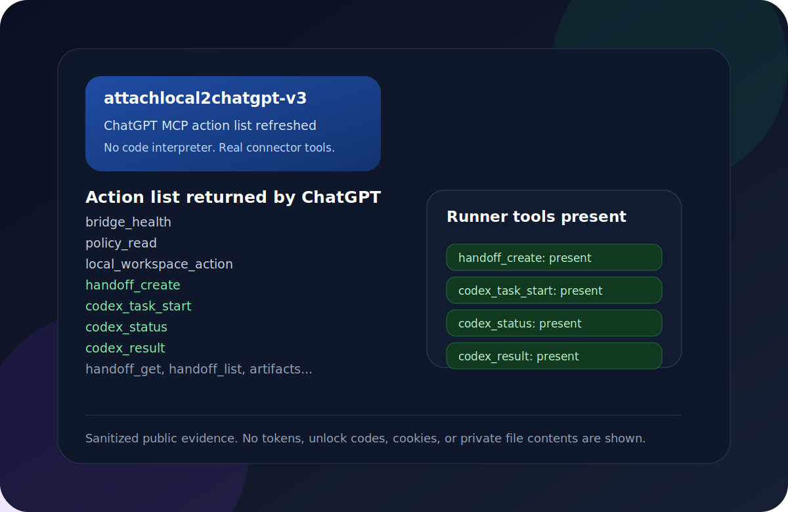

<div align="center">
  
  <h1>ChatGPT2LocalBridge</h1>
  <p><strong>Codex / ChatGPT Plugin App for approved local workspaces.</strong></p>
  <p>
    
    
    
    
    
    
    
    
  </p>
  <p>
    <a href="./docs/index.html">Pages source</a>
    ·
    <a href="./docs/showcase.html">Showcase</a>
    ·
    <a href="./docs/human-tutorial.html">Human tutorial</a>
    ·
    <a href="./docs/agent-computer-use.html">Agent tutorial</a>
    ·
    <a href="./docs/authentication-modes.md">Auth modes</a>
    ·
    <a href="./docs/linux-deploy.md">Linux deploy</a>
    ·
    <a href="./docs/alternatives.md">Alternatives</a>
    ·
    <a href="./docs/sync-flows.md">Sync flows</a>
    ·
    <a href="./docs/skill-runtime-roadmap.md">Skill runtime</a>
    ·
    <a href="./docs/handoff-spec.md">Handoff spec</a>
    ·
    <a href="./docs/codex-analytics.md">Codex analytics</a>
    ·
    <a href="./docs/evidence.md">Evidence</a>
    ·
    <a href="./docs/promo/xhs-note.md">Promo copy</a>
    ·
    <a href="./docs/promo/mobile-codex-runner.md">Mobile promo</a>
    ·
    <a href="./ROADMAP.md">Roadmap</a>
  </p>
</div>

## Linux One-Click Prompt

Repository: `https://github.com/Harzva/chatgpt2localbridge`

Copy this prompt to a Linux shell agent:

```text
Install ChatGPT2LocalBridge from https://github.com/Harzva/chatgpt2localbridge on this Linux host.
Use one command, keep secrets local, and do not print .env.local, OAuth tokens,
ngrok authtokens, cookies, or unlock codes into chat.

Run:
curl -fsSL https://raw.githubusercontent.com/Harzva/chatgpt2localbridge/main/scripts/linux-one-click-install.sh | bash

After install, report the local health result, the ChatGPT Connector fields, and
the tunnel choice. If ngrok is selected, ask me for NGROK_AUTHTOKEN and optional
NGROK_DOMAIN. If Cloudflare is selected, explain quick tunnel vs named tunnel.
```

Or run it yourself:

```bash
curl -fsSL https://raw.githubusercontent.com/Harzva/chatgpt2localbridge/main/scripts/linux-one-click-install.sh | bash
```

The installer prints every Connector field you need to fill in ChatGPT, plus
ngrok and Cloudflare registration links, tunnel tradeoffs, and an agent-safe
setup prompt.


<!-- showcase:start -->
<p align="center">
  
</p>
<!-- showcase:end -->

ChatGPT2LocalBridge is a self-hosted **Codex / ChatGPT Plugin App**: a local desktop/operator app plus an MCP connector that lets ChatGPT access approved local workspaces after authorization. It is designed for people who want ChatGPT or Codex-style agents to inspect, bundle, download, trace, or operate on local project files without uploading the whole workspace elsewhere.

The TypeScript build is the full OAuth MCP connector. A small Rust native
preview also lives in [`rust/chatgpt2localbridge-rs`](./rust/chatgpt2localbridge-rs)
for the local operator console, health checks, activity APIs, and a minimal MCP
smoke surface.

In this repository, **plugin app** means a small agent-facing product surface: a local app, a policy file, a tool catalog, trace records, and one or more ChatGPT/Codex-visible MCP tools. It is not a legacy ChatGPT plugin. It is best described as:

- **Codex Plugin App**
- **ChatGPT Plugin App**
- **MCP Server**
- **ChatGPT Custom Connector**
- **OAuth Local Workspace Bridge**

> Unofficial project. Not affiliated with OpenAI.

## Build Your Own Plugin App

This project is also an invitation to build more agent-facing plugin apps. A good plugin app should give ChatGPT or Codex a focused tool surface, keep risky operations behind policy, and give the human operator a clear local console.

| Layer | What to build | Example in this repo |
| --- | --- | --- |
| Agent interface | MCP tools with concise names, schemas, and safe defaults | `project.bundle`, `policy.read`, `codex.task_start` |
| Skill runtime | Local skills are discovered through approved roots, manifests, and stable registry tools | `skill.list`, `skill.route`, planned `skill.invoke` |
| Human control | A local app that shows status, policy, traces, and cancel buttons | Native macOS console |
| Safety policy | Approved roots, deny globs, auth mode, shell restrictions | `bridge.policy.json` |
| Distribution | README, GitHub Pages, screenshots, setup prompts, install scripts | `docs/`, `npx github:...`, macOS app bundle |

If you build your own plugin app, keep the default workflow narrow and readable: one clear problem, one safe tool surface, one local control panel, and one copyable ChatGPT test prompt.

The next product direction is a **Local Skill OS**: local skills stay in approved
skill roots, the bridge exposes a stable registry surface, and the app shows
which skills are readable, routable, invokable, or blocked. See the
[Skill Runtime Roadmap](./docs/skill-runtime-roadmap.md).

The main execution path is moving toward **Handoff -> Codex Runner**: ChatGPT
creates a structured handoff, the bridge validates and stores it, then local
Codex CLI performs the project work. See the [Handoff Spec](./docs/handoff-spec.md).

## Route

```text
ChatGPT
  -> OAuth MCP Connector
  -> HTTPS tunnel
  -> http://127.0.0.1:3838/mcp
  -> ChatGPT2LocalBridge
  -> approved local workspace roots
```

ChatGPT does not directly mount your disk. It calls MCP tools, and every file operation is checked against `bridge.policy.json`.

## Architecture

<p align="center">
  
</p>

The intended product shape is a control plane, not just a raw shell bridge:

- **ChatGPT Web** makes structured MCP calls.
- **Connector auth** should use OAuth or Secure MCP Tunnel for public access.
- **Bridge policy** gates roots, deny globs, shell mode, timeouts, and traces.
- **Tool tiers** guide ChatGPT toward safer project and Codex Runner workflows.
- **Local app** shows policy, tool calls, logs, diffs, downloads, and cancellable tasks.

## 30-Second Install

Linux one-click installer:

```bash
curl -fsSL https://raw.githubusercontent.com/Harzva/chatgpt2localbridge/main/scripts/linux-one-click-install.sh | bash
```

Optional Linux tunnel helpers:

```bash
curl -fsSL https://raw.githubusercontent.com/Harzva/chatgpt2localbridge/main/scripts/linux-one-click-install.sh | TUNNEL=cloudflare bash
curl -fsSL https://raw.githubusercontent.com/Harzva/chatgpt2localbridge/main/scripts/linux-one-click-install.sh | TUNNEL=ngrok NGROK_AUTHTOKEN=... NGROK_DOMAIN=my-bridge.ngrok-free.app bash
```

Temporary GitHub npx install, no clone required:

```bash
npx github:Harzva/chatgpt2localbridge init --root ~/Projects
set -a; source .env.local; set +a
npx github:Harzva/chatgpt2localbridge --http 3838
```

Local clone flow:

```bash
git clone https://github.com/harzva/chatgpt2localbridge.git
cd chatgpt2localbridge
npm install
npm run build
node dist/index.js init --root ~/Projects
set -a; source .env.local; set +a
node dist/index.js --http 3838
```

Health check:

```bash
curl -sS http://127.0.0.1:3838/health
```

Local operator console:

```text
http://127.0.0.1:3838/app
```

Rust native preview:

```bash
cargo run --manifest-path rust/chatgpt2localbridge-rs/Cargo.toml -- --http 3842
```

The Rust preview intentionally exposes a smaller MCP surface today:
`initialize`, `tools/list`, `bridge.health`, `bridge.activity`, and `file.list`.

Native macOS app:

```bash
npm run macos:install
open /Applications/ChatGPT2LocalBridge.app
```

The macOS app is a native AppKit/SwiftUI desktop console that embeds the Rust
engine, uses the repository logo as its `.icns` icon, manages the local `3842`
service, and shows the ChatGPT-visible MCP tool catalog, browser bundle prompts,
approved roots, editable policy, logs, connector tool calls, skill reads, write
events, and cloud-download trace records without needing the browser console.

The native **Policy Center** edits the local policy safely:

- workspace roots stay separate from skill roots
- the default skill root is `~/.codex/skills`
- saving creates `bridge.policy.backup.json`
- policy changes are written to local audit trace
- the app warns if you expose broad paths such as `~/.codex`

## Downloads And Releases

GitHub Releases provide prebuilt artifacts for local testing:

- `ChatGPT2LocalBridge-macos-*.dmg`: drag-and-run macOS native control
  console with the Rust companion binary bundled inside the app.
- `ChatGPT2LocalBridge-macos-*.app.zip`: native macOS control console with the
  Rust companion binary bundled inside the app.
- `ChatGPT2LocalBridge-windows-x64-rust-preview.zip`: Windows Rust-native local
  console preview.
- `chatgpt2localbridge-*.tgz`: npm package for the full TypeScript OAuth MCP
  bridge.

The Windows artifact is currently a Rust preview, while the full OAuth connector
surface remains the Node/TypeScript package. Release builds are generated by
`.github/workflows/release.yml` when a `v*` tag is pushed.
See [Windows Roadmap](./docs/windows-roadmap.md) for the current preview scope.

Release route:

```bash
npm run typecheck
npm test
npm run macos:app
git tag v0.1.x
git push origin v0.1.x
```

The release workflow attaches macOS `.dmg` / `.app.zip`, a Windows Rust preview
zip, an npm tarball, and SHA256 files.

## ChatGPT Connector Setup

### Choose An Auth Mode

ChatGPT's custom connector UI may offer OAuth, No Authentication, and Mixed Authentication. This project supports more than one path, but the safe default depends on where the endpoint is reachable.

| Connector auth | Use when | Notes |
| --- | --- | --- |
| OAuth | Any public HTTPS tunnel, including Mac mini with ngrok/Cloudflare or a Linux server tunnel | Recommended default. ChatGPT completes an OAuth code flow and later calls `/mcp` with a bearer token. |
| No Authentication | Short-lived loopback-only or private-network tests | Works only if the bridge is intentionally running without OAuth. Do not use this on a public tunnel. |
| Mixed | Advanced per-tool policy where public tools are anonymous and privileged tools require OAuth | Useful later if you split tools by risk. The current public-safe guide keeps the whole connector OAuth-protected. |

If both OAuth and No Authentication appear to work, prefer OAuth for anything reachable from ChatGPT over the internet. No Authentication means the URL itself is the control surface.

Expose the local server through HTTPS:

```bash
ngrok http 3838 --url=your-fixed-domain.ngrok-free.dev
```

Then create a ChatGPT Custom Connector:

| Field | Value |
| --- | --- |
| Name | `ChatGPT2LocalBridge` |
| URL | `https://your-fixed-domain.ngrok-free.dev/mcp` |
| Auth | OAuth |

When the authorization page opens, enter the unlock code from `.env.local`. Do not paste unlock codes or tokens into public chats, issues, screenshots, or commits.

### Linux Server Setup

Linux works the same way as Mac mini: run one bridge next to the files you want ChatGPT to see, expose that bridge through HTTPS, then create a separate ChatGPT connector for that machine.

One-click install directly on the Linux host:

```bash
curl -fsSL https://raw.githubusercontent.com/Harzva/chatgpt2localbridge/main/scripts/linux-one-click-install.sh | bash
```

Common options:

```bash
curl -fsSL https://raw.githubusercontent.com/Harzva/chatgpt2localbridge/main/scripts/linux-one-click-install.sh | WORKSPACE_ROOT=/srv/workspace BRIDGE_PORT=3900 bash
```

The installer prints the exact ChatGPT Connector fields, local health checks,
ngrok registration requirements, Cloudflare registration requirements, and a
longer agent prompt for safe remote setup.

Deploy from an existing local clone to a remote Linux host:

```bash
REMOTE=linux-box \
REMOTE_WORKSPACE=/srv/workspace \
REMOTE_ALLOWED_ROOTS="/srv/workspace,/home/agent/projects" \
PUBLIC_BASE_URL=https://linux-bridge.example.com \
bash scripts/deploy-linux-bridge.sh
```

Create a second connector such as `ChatGPT2LocalBridge Linux` with:

| Field | Value |
| --- | --- |
| URL | `https://linux-bridge.example.com/mcp` |
| Auth | OAuth |

Use separate connectors for separate machines so each policy can stay narrow. See [Linux deployment](./docs/linux-deploy.md).

## Screenshot Walkthrough

| Step | Preview |
| --- | --- |
| Initialize local policy |  |
| Run local MCP server |  |
| Review Policy Center |  |
| Check `/health` |  |
| Create connector |  |
| Authorize |  |
| Test file listing |  |

## macOS Screenshot CLI

Use the Mac mini helper when you need real screenshots for README, GitHub Pages,
release notes, or social posts. Outputs default to `docs/assets/app_screenshots`.

```bash
npm run shot:selection   # choose any screen area
npm run shot:window      # click any window
npm run shot:full        # capture the full screen
npm run shot:app         # capture the ChatGPT2LocalBridge window bounds
```

Direct usage:

```bash
scripts/mac-screenshot.sh --rect 100,120,1280,760 --out docs/assets/app_screenshots/dashboard.png
scripts/mac-screenshot.sh --app "ChatGPT2LocalBridge" --open --copy-path
```

If macOS blocks capture, grant Screen Recording permission to Terminal, iTerm,
or the agent process in System Settings.

Full guides:

- [Human setup tutorial](./docs/human-tutorial.html)
- [Agent + Computer Use tutorial](./docs/agent-computer-use.html)
- [Visual showcase gallery](./docs/showcase.html)
- [Markdown human tutorial](./docs/tutorial-human.md)
- [Markdown agent tutorial](./docs/tutorial-agent-computer-use.md)

## Main MCP Tools

### Tool Tiers

| Tier | Default use | Tools |
| --- | --- | --- |
| High-level agent workflow | Recommended entry point for Web ChatGPT once Codex Runner lands | `codex.task_start`, `codex.status`, `codex.result` |
| Mid-level project workflow | Preferred today for reading context, checking policy, inspecting diffs, and running tests | `project.bundle`, `policy.read`, `git.diff`, `test.run` |
| Low-level debug primitives | Advanced troubleshooting only; avoid as the normal ChatGPT path | `file.read_path`, `file.write`, `shell.exec` |

The roadmap tracks the move from low-level primitives toward a safer Codex Runner surface. See [ROADMAP.md](./ROADMAP.md).

### Tool Profiles

ChatGPT2LocalBridge already uses a profile gate to progressively expose tools:
a small public connector surface, a standard daily surface, and a full debug
surface. For clearer public docs, it now accepts both product-facing profile
names and the earlier internal aliases:

| Profile | Alias | Use |
| --- | --- | --- |
| `minimal` | `chatgpt-app` | Smallest ChatGPT connector surface; compatibility aliases only. |
| `standard` | `normal` | Recommended default for project, policy, skills, git, tests, traces, and Codex task workflows. |
| `full` | `debug` | Trusted local debugging with low-level file, process, shell, and service tools exposed. |
| `codex-runner-only` | `codex-runner-only` | High-level Codex task control plane without general project tools. |

Set it with:

```bash
LOCALBRIDGE_TOOL_PROFILE=standard
```

Use `minimal` for the first public connector test, `standard` for daily work,
and `full` only for focused debugging where you want the raw primitives visible.

This profile model is part of the bridge's own tool router and progressive
disclosure roadmap: expose only the tools needed for the current trust level,
then let the local app and trace records explain what happened.

| Area | Examples |
| --- | --- |
| Project | `project.snapshot`, `project.bundle`, `project.index`, `project.scripts` |
| Handoff | `handoff.create` |
| Policy | `policy.read`, `policy.validate` |
| Skills | `skill.list`, `skill.search`, `skill.read`, `skill.bundle`, `skill.route` |
| Code | `code.read`, `code.read_range`, `code.search` |
| Files | `file.list`, `file.read_path`, `file.stat`, `file.write`, `file.patch`, `file.delete` |
| Shell/tests | `shell.exec`, `test.detect`, `test.run` |
| Git | `git.status`, `git.diff`, `git.checkpoint`, `git.revert` |
| Runtime | `workspace.*`, `task.*`, `process.*`, `port.check` |
| Cloud sync | `cloud.download` |
| Bridge | `bridge.status`, `bridge.health`, `bridge.logs`, `bridge.activity`, `service.restart` |

The full ChatGPT-visible tool catalog is generated from MCP `tools/list` into
[`assets/mcp-tools.json`](./assets/mcp-tools.json):

```bash
npm run tools:catalog
```

`project.bundle` is the recommended multi-file context tool. It returns a
directory summary, selected text files, and optional git diff in one read-only
call, so ChatGPT can read local first and then create a cloud-side downloadable
copy from the returned content.

`skill.*` tools make local Codex skills readable through the connector without
turning the whole Codex runtime directory into a workspace. Configure:

```json
{
  "skillRoots": [
    "/Users/YOUR_USERNAME/.codex/skills"
  ]
}
```

Project-local skills are also discovered from approved project roots at
`.codex/skills`. Reference files are gated: call `skill.read` on a `SKILL.md`
first, then pass the returned `activationId` to `skill.bundle` so it can include
referenced local files such as `references/*.md`.

Do not approve the whole `~/.codex` directory. It can contain sessions,
attachments, local configuration, and other private runtime files.

## Codex Provider Profiles

Codex Runner can use either the normal Codex CLI login or an OpenAI-compatible
API endpoint. This keeps sub2api optional: run sub2api separately, then point
the bridge at its `/v1` endpoint.

```bash
LOCALBRIDGE_CODEX_BIN=/Users/YOUR_USERNAME/.local/bin/codex
LOCALBRIDGE_CODEX_PROVIDER=sub2api
LOCALBRIDGE_CODEX_BASE_URL=http://127.0.0.1:4999/v1
LOCALBRIDGE_CODEX_API_KEY_ENV=SUB2API_KEY
SUB2API_KEY=...
```

The native app has a Codex Provider page for editing these local settings.
Trace output records the provider kind and base URL host only; API keys are not
written into tool results or audit logs.

If ChatGPT shows `spawn codex ENOENT`, the connector and handoff tools are
working, but the background service cannot find the Codex CLI. Set
`LOCALBRIDGE_CODEX_BIN` to the absolute `codex` path, or install Codex in one
of the service-friendly locations such as `~/.local/bin`, `/opt/homebrew/bin`,
or `/usr/local/bin`.

## File Sync And Activity

- Local files can be read by ChatGPT through approved MCP tools.
- Multiple local files can be bundled with `project.bundle`.
- MCP-read local file content can be re-emitted by ChatGPT as a cloud-side downloadable artifact when the user wants a copy in the conversation.
- For stable Trace Studio grouping, ask ChatGPT to call `trace.session_start` at the beginning of each conversation, and `task.start` before long multi-step work.
- ChatGPT/App-provided cloud file download URLs can be written back to local disk with `cloud.download`.
- Tool calls are persisted to `tool-calls.jsonl`.
- File writes, downloads, tasks, processes, and service restarts are persisted to `audit.jsonl`.
- The local console at `/app` and native macOS app show status, tool calls, and audit events.

See [file sync flows](./docs/sync-flows.md).

## Field Evidence

The current release includes sanitized evidence from local and ChatGPT connector
tests: build/test output, macOS app installation, tool catalog counts, write
smoke tests, and connector troubleshooting notes. See
[`docs/evidence.md`](./docs/evidence.md).

Latest connector proof: after recreating the ChatGPT custom connector as
`attachlocal2chatgpt-v3`, ChatGPT's action list exposed the high-level handoff
and Codex Runner entry points:

<p align="center">
  
</p>

Field note: keep `xhigh` / `XHigh` mode off by default. In local testing it
produced more connector/tool-call errors than the normal profile, so use it only
for focused debugging with trace capture enabled.

Field note: `codex.result` and `codex_result` return compact summaries by
default. Full logs and diffs are opt-in with `includeLog` / `includeDiff`
because hosted ChatGPT safety checks can block large execution records.

## Star History

<a href="https://www.star-history.com/?repos=Harzva%2Fchatgpt2localbridge&type=date&legend=top-left">
 <picture>
   <source media="(prefers-color-scheme: dark)" srcset="https://api.star-history.com/chart?repos=Harzva/chatgpt2localbridge&type=date&theme=dark&legend=top-left" />
   <source media="(prefers-color-scheme: light)" srcset="https://api.star-history.com/chart?repos=Harzva/chatgpt2localbridge&type=date&legend=top-left" />
   
 </picture>
</a>

## Security Defaults

- Do not run unauthenticated on a public URL.
- Keep `allowedProjectRoots` narrow.
- Keep `skillRoots` narrow; prefer `~/.codex/skills`, not `~/.codex`.
- Never commit `.env.local`, `bridge.policy.json`, OAuth stores, tokens, cookies, or unlock codes.
- Prefer OAuth over URL tokens.
- Set `LOCALBRIDGE_DASHBOARD_TOKEN` before using `/app`.
- Review shell deny rules before enabling shell access for broad workspaces.

See [security model](./docs/security.md).

## Alternatives

OAuth + fixed HTTPS tunnel is the default because it fits ChatGPT Custom Connectors well. Other options exist:

- OpenAI Secure MCP Tunnel, when available to your workspace
- Cloudflare Tunnel
- VPS reverse proxy
- Static bearer token for private clients
- Loopback-only no-auth testing

See [alternatives](./docs/alternatives.md).

## GitHub Pages

The static product site lives in [`docs/`](./docs/index.html). The repository includes a GitHub Actions workflow that deploys it to GitHub Pages after pushing to `main`.

## Development

```bash
npm install
npm run typecheck
npm run tools:catalog
npm test
npm pack --dry-run
cargo test --manifest-path rust/chatgpt2localbridge-rs/Cargo.toml
cargo build --manifest-path rust/chatgpt2localbridge-rs/Cargo.toml
cargo build --release --manifest-path rust/chatgpt2localbridge-rs/Cargo.toml
npm run macos:app
npm run macos:install
```

Render README and docs assets:

```bash
npm run docs:assets
npm run docs:preview
```

## Public Release Checklist

- [ ] Enable GitHub Pages with the included workflow.
- [ ] Confirm `npm test` passes in GitHub Actions.
- [ ] Confirm the macOS `.dmg` and `.app.zip` download, unzip/mount, and launch.
- [ ] Confirm the Windows Rust preview starts `http://127.0.0.1:3842/app`.
- [ ] Keep `.env.local` and `bridge.policy.json` untracked.
- [ ] Verify the ChatGPT connector uses OAuth and the correct `/mcp` URL.

## License

MIT
