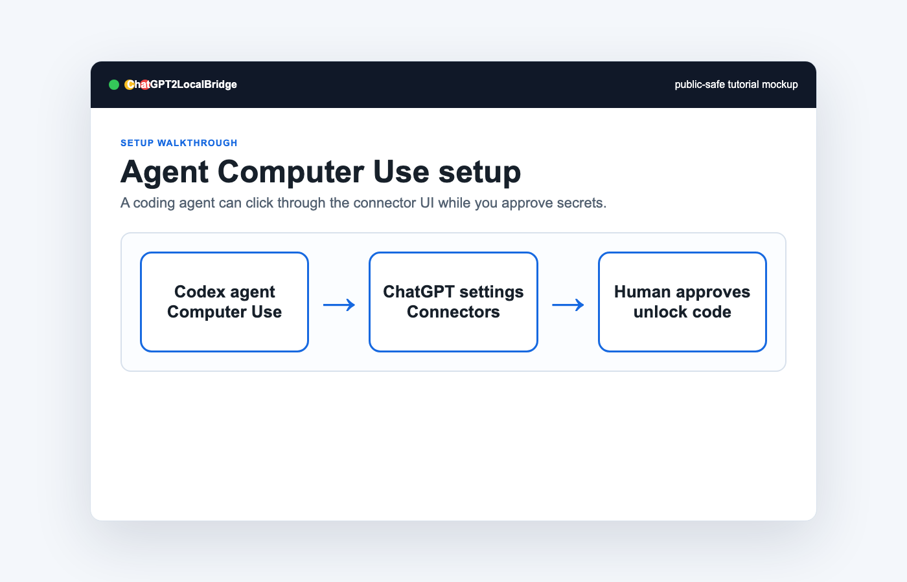

# Agent + Computer Use Tutorial

Use this when a local coding agent is allowed to help click through ChatGPT settings.



Safety rules:

- The agent must not print tokens or unlock codes.
- The human operator handles browser trust prompts and final approval.
- The agent should verify `/health`, OAuth metadata, and a minimal tool call.
- Use OAuth for public tunnels. No Authentication is for short-lived private tests only.
- Use a separate connector for Linux paths instead of reusing a Mac connector.
- The agent should call `policy.read` before broad file operations.
- The agent should use `skill.route` or `skill.search` before reading local skills.

Suggested prompt:

```text
You are configuring ChatGPT2LocalBridge with Computer Use.
Verify local health, open ChatGPT connector settings, create a custom OAuth connector for public tunnels, stop for human approval on unlock code or safety prompts, then test a minimal `file.list` or `file.read_path` call.
After authorization, call policy.read and confirm skillRoots points to ~/.codex/skills instead of the whole ~/.codex directory.
Never print tokens or unlock codes.
```
