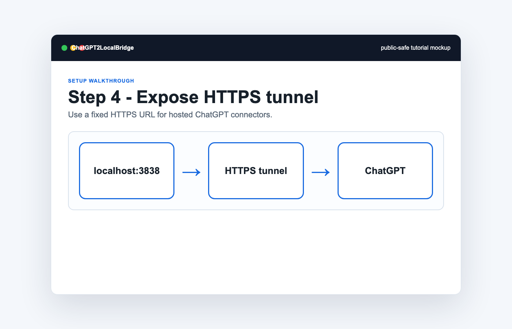

# Human Setup Tutorial

This markdown version mirrors the GitHub Pages walkthrough.

1. Initialize a local policy.
   
2. Run the local MCP server.
   
3. Check `/health`.
   
4. Expose a public HTTPS tunnel.
   
5. Create the ChatGPT connector.
   
6. Authorize with the local unlock code.
   
7. Select the connector and test `file.list`.
   
